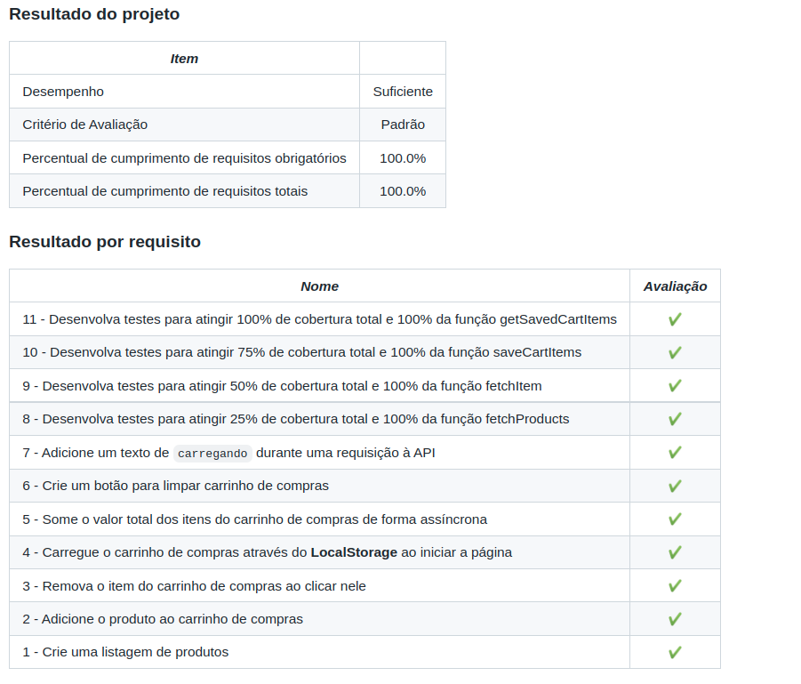

<h1>Sobre</h1>

Último projeto do módulo 1 - Fundamentos, da <a href="https://betrybe.com" target="_blank">Trybe!</a>

A proposta foi criar um carrinho de compras utilizando, principalmente, uma API do Mercado Livre, operações assíncronas e testes com o JEST.

obs: O conteúdo da pasta mocks e todo o CSS foram disponibilizados pela Trybe.

<h1>Tecnologias utilizadas</h1>
<ul>
  <li>HTML</li>
  <li>CSS</li>
  <li>JavaScript</li>
</ul>

<h1>Nota</h1>

